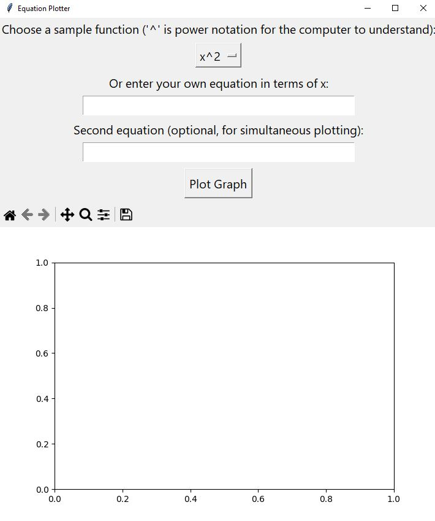
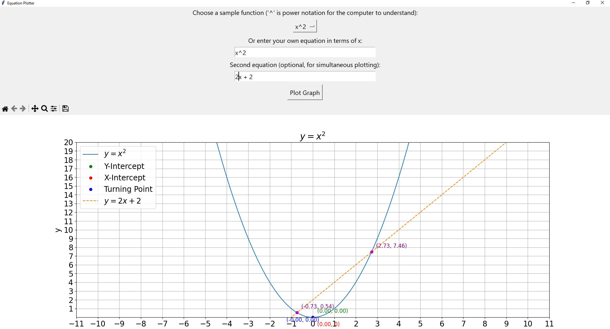

# Equation Plotter

Interactive equation plotter built for classroom use, helping teachers demonstrate quadratic and simultaneous equations to students aged 11–16. Features automatic intercept and turning point detection, simultaneous graph plotting with intersection solving, and distributed as a standalone offline exe.

> Built as a rapid prototype to explore modern AI-assisted development workflows. Developed in under 2 hours using AI tooling to accelerate scaffolding and feature generation, with manual review, debugging, and iteration on top.

---

## Features

- Plot any equation in terms of `x` using standard notation (`^` for powers)
- Automatic detection and annotation of:
  - Y-intercept
  - X-intercepts
  - Turning point (quadratic equations)
- Plot a second equation simultaneously and solve for intersection points
- Sample function dropdown for quick classroom demos
- Runs fully offline — no internet connection required



---

## Tech Stack

- **Python** — core language
- **tkinter** — desktop GUI
- **sympy** — symbolic maths (solving intercepts and intersections analytically)
- **numpy** — numerical evaluation for plotting
- **matplotlib** — graph rendering with interactive navigation toolbar
- **PyInstaller** — packaging as a standalone Windows exe

---

## Running from Source

### Prerequisites

- Python 3.8+
- pip

### Install dependencies

```bash
pip install -r requirements.txt
```

### Run

```bash
python src/main.py
```

---

## Building the Exe

Requires [PyInstaller](https://pyinstaller.org/), which is included in `requirements.txt`.

```bash
pyinstaller src/main.spec
```

The built exe will be output to `src/dist/`.

---

## Project Status

This is a working prototype. Planned improvements include:

- Configurable x/y axis range
- Improved error handling
- UI polish for classroom display scenarios
